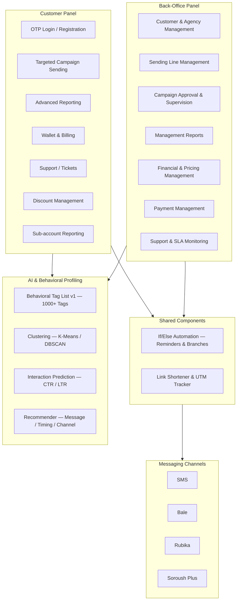
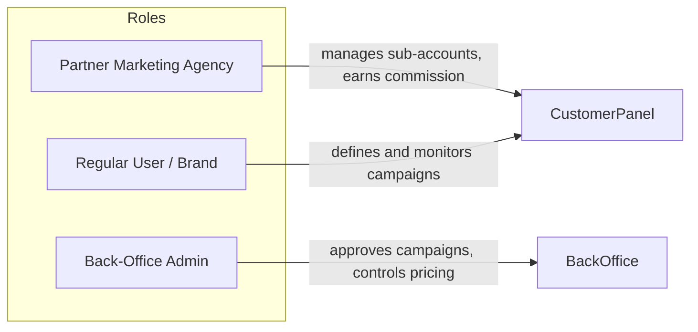
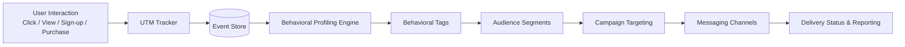

# Jazebeh Platform — Overall Architecture

## System Components

```mermaid
graph TB
    subgraph CustomerPanel["Customer Panel"]
        CP1[OTP Login / Registration]
        CP2[Targeted Campaign Sending]
        CP3[Advanced Reporting]
        CP4[Wallet & Billing]
        CP5[Support / Tickets]
        CP6[Discount Management]
        CP7[Sub-account Reporting]
    end

    subgraph BackOffice["Back-Office Panel"]
        BO1[Customer & Agency Management]
        BO2[Sending Line Management]
        BO3[Campaign Approval & Supervision]
        BO4[Management Reports]
        BO5[Financial & Pricing Management]
        BO6[Payment Management]
        BO7[Support & SLA Monitoring]
    end

    subgraph Shared["Shared Components"]
        S1[If/Else Automation — Reminders & Branches]
        S2[Link Shortener & UTM Tracker]
    end

    subgraph AI["AI & Behavioral Profiling"]
        AI1[Behavioral Tag List v1 — 1000+ Tags]
        AI2[Clustering — K-Means / DBSCAN]
        AI3[Interaction Prediction — CTR / LTR]
        AI4[Recommender — Message / Timing / Channel]
    end

    subgraph Channels["Messaging Channels"]
        CH1[SMS]
        CH2[Bale]
        CH3[Rubika]
        CH4[Soroush Plus]
    end

    CustomerPanel --> Shared
    BackOffice --> Shared
    CustomerPanel --> AI
    BackOffice --> AI
    Shared --> Channels
```

---

## User Roles

```mermaid
graph LR
    subgraph Roles
        R1[Partner Marketing Agency]
        R2[Regular User / Brand]
        R3[Back-Office Admin]
    end

    R1 -->|manages sub-accounts, earns commission| CustomerPanel
    R2 -->|defines and monitors campaigns| CustomerPanel
    R3 -->|approves campaigns, controls pricing| BackOffice
```

---

## Data & Event Flow

```mermaid
flowchart LR
    U[User Interaction\nClick / View / Sign-up / Purchase] --> UTM[UTM Tracker]
    UTM --> DB[(Event Store)]
    DB --> AI[Behavioral Profiling Engine]
    AI --> Tags[Behavioral Tags]
    Tags --> Segments[Audience Segments]
    Segments --> Campaign[Campaign Targeting]
    Campaign --> Channels[Messaging Channels]
    Channels --> Status[Delivery Status & Reporting]
```
