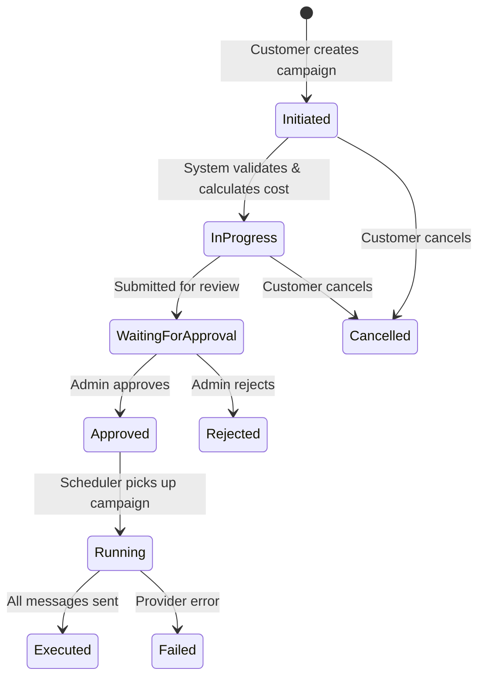
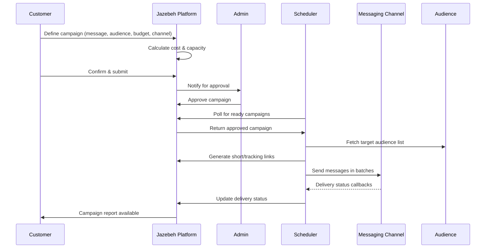
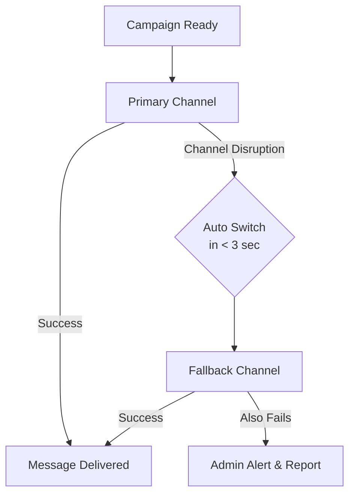

# Campaign Lifecycle & Multi-Channel Flow

## Campaign Lifecycle

---

## End-to-End Campaign Execution

---

## Multi-Channel Fallback Routing

---

## Supported Channels

| Channel | Type | Notes |
|---|---|---|
| SMS | Text | Bulk, OTP, transactional |
| Bale | Messenger | Rich media, domestic |
| Rubika | Messenger | Rich media, domestic |
| Soroush Plus | Messenger | Direct API, domestic |
