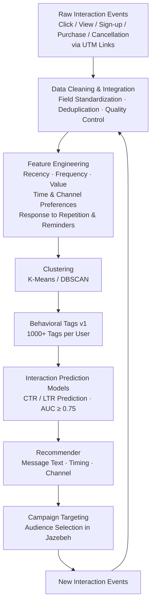
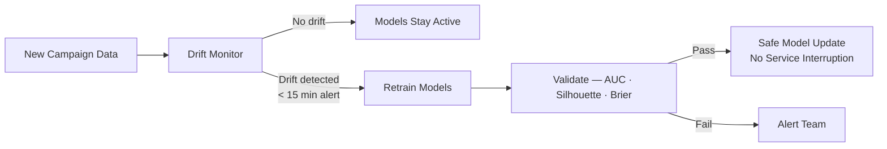
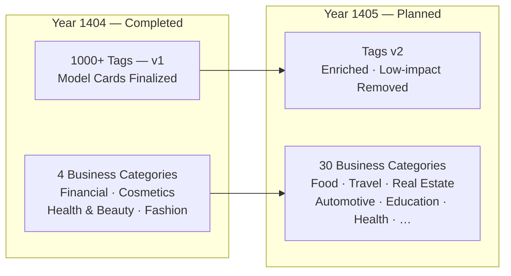

# AI & Behavioral Profiling Pipeline

## End-to-End Pipeline

```mermaid
flowchart TD
    A[Raw Interaction Events\nClick / View / Sign-up / Purchase / Cancellation\nvia UTM Links] --> B[Data Cleaning & Integration\nField Standardization · Deduplication · Quality Control]
    B --> C[Feature Engineering\nRecency · Frequency · Value\nTime & Channel Preferences\nResponse to Repetition & Reminders]
    C --> D[Clustering\nK-Means / DBSCAN]
    D --> E[Behavioral Tags v1\n1000+ Tags per User]
    E --> F[Interaction Prediction Models\nCTR / LTR Prediction · AUC ≥ 0.75]
    F --> G[Recommender\nMessage Text · Timing · Channel]
    G --> H[Campaign Targeting\nAudience Selection in Jazebeh]
    H --> I[New Interaction Events]
    I --> B
```

---

## Continuous Learning Loop

```mermaid
flowchart LR
    NewData[New Campaign Data] --> Monitor[Drift Monitor]
    Monitor -->|No drift| Models[Models Stay Active]
    Monitor -->|Drift detected\n< 15 min alert| Retrain[Retrain Models]
    Retrain --> Validate[Validate — AUC · Silhouette · Brier]
    Validate -->|Pass| Deploy[Safe Model Update\nNo Service Interruption]
    Validate -->|Fail| Alert[Alert Team]
```

---

## Behavioral Tags — Coverage Plan

```mermaid
graph LR
    subgraph Year1404["Year 1404 — Completed"]
        T1[1000+ Tags — v1\nModel Cards Finalized]
        S1[4 Business Categories\nFinancial · Cosmetics\nHealth & Beauty · Fashion]
    end
    subgraph Year1405["Year 1405 — Planned"]
        T2[Tags v2\nEnriched · Low-impact Removed]
        S2[30 Business Categories\nFood · Travel · Real Estate\nAutomotive · Education · Health · …]
    end
    T1 --> T2
    S1 --> S2
```
