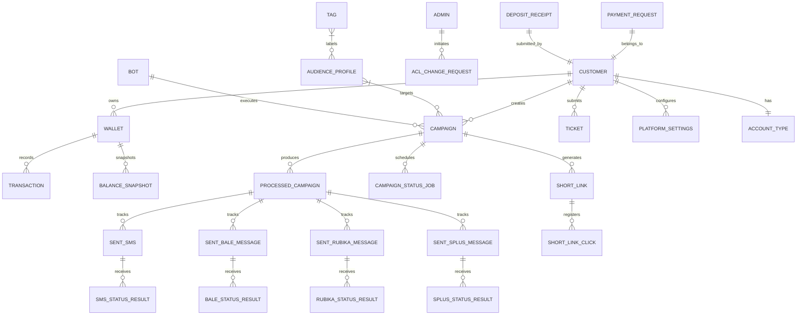
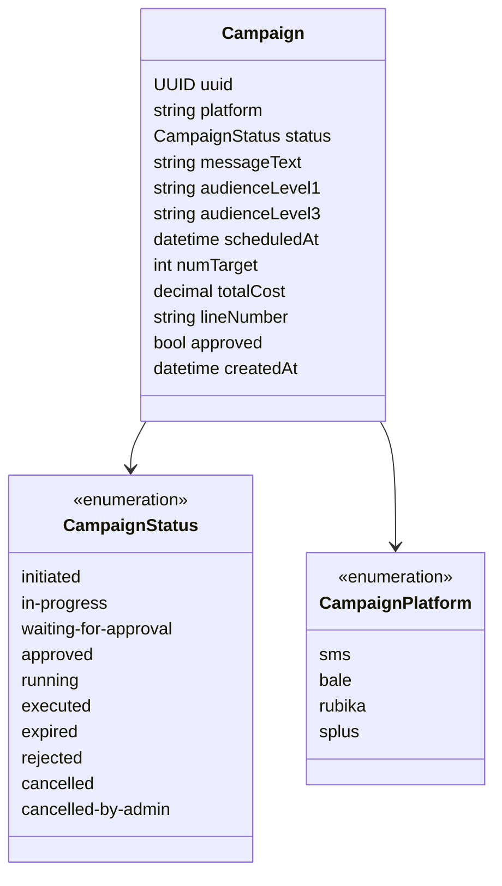
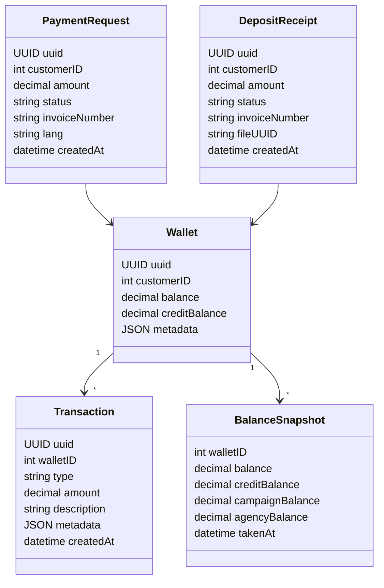
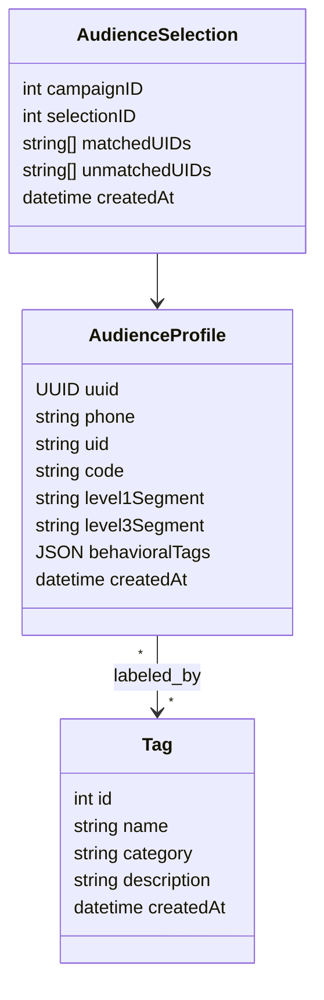
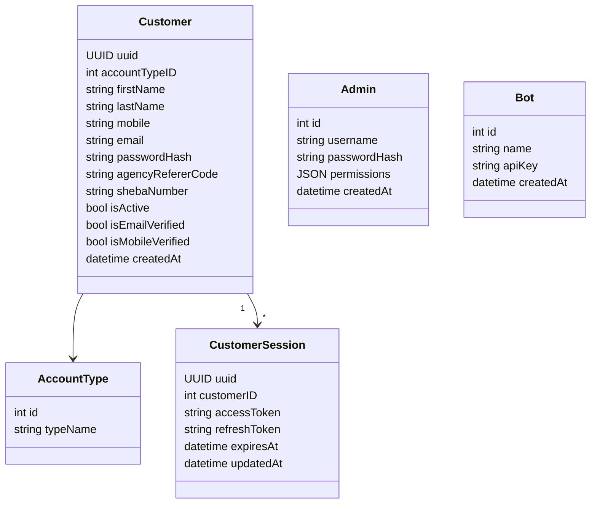
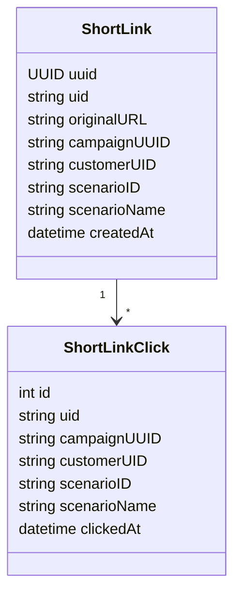

# Data Model — Core Entities

## Entity Relationship Overview

---

## Campaign Entity

---

## Financial Entities

---

## Audience & Tagging

---

## Account & Auth Entities

---

## Key Account Types

| Type | Description |
|---|---|
| `MarketingAgency` | Partner agency — manages sub-accounts, earns commission |
| `Individual` | Regular brand/company user |

---

## Messaging Sent-Message Entities

| Entity | Platform | Key Fields |
|---|---|---|
| `SentSMS` | SMS | trackingID, phone, status, providerRef |
| `SentBaleMessage` | Bale | recipientID, messageID, status |
| `SentRubikaMessage` | Rubika | recipientID, messageID, status |
| `SentSplusMessage` | Soroush Plus | recipientID, messageID, status |

Each has a corresponding `*StatusResult` table that stores provider delivery callbacks.

---

## Short Link & UTM Tracking

