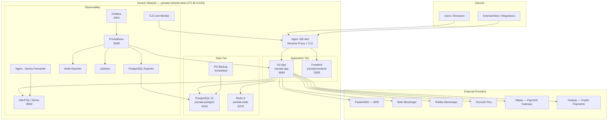
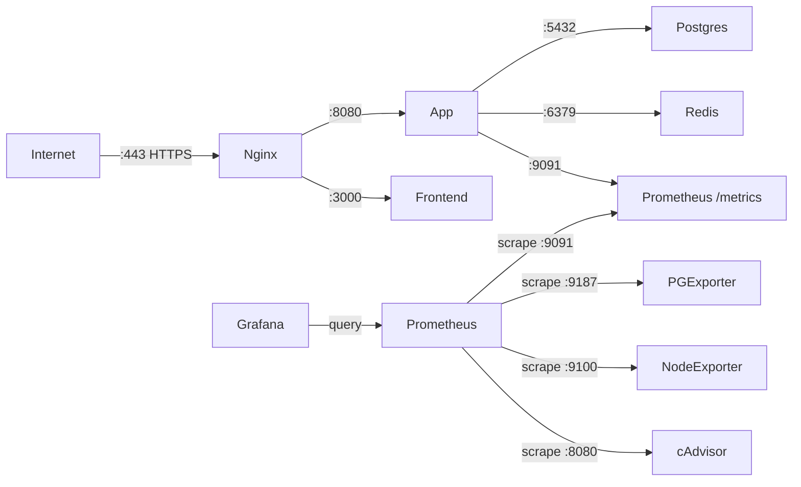
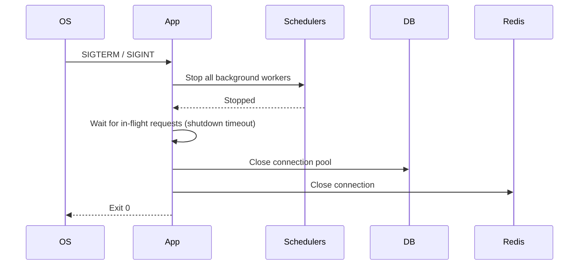

# Deployment Architecture

## Infrastructure Overview

---

## Container Inventory

| Container | Image | Role |
|---|---|---|
| `yamata-app` | `yamata-no-orochi` | Go API server |
| `yamata-frontend` | `yamata-frontend` | Frontend SPA |
| `yamata-nginx` | `nginx:1.29-alpine` | Reverse proxy, TLS termination |
| `yamata-postgres` | `postgres:15-alpine` | Primary database |
| `yamata-redis` | `redis:8.0.3-alpine` | Cache & rate-limit store |
| `yamata-postgres-backup` | `postgres:15-alpine` | Scheduled DB backups |
| `yamata-prometheus` | `prom/prometheus:v3.5.0` | Metrics collection |
| `yamata-grafana` | `grafana/grafana:12.1.0` | Dashboards |
| `yamata-sentry` | `glitchtip/glitchtip` | Error tracking (self-hosted) |
| `yamata-sentry-postgres` | `postgres:15-alpine` | GlitchTip database |
| `yamata-sentry-redis` | `redis:8.0.3-alpine` | GlitchTip cache |
| `yamata-postgres-exporter` | `postgres-exporter:v0.15` | DB metrics for Prometheus |
| `yamata-node-exporter` | `node-exporter:v1.10.2` | Host metrics |
| `yamata-cadvisor` | `cadvisor:v0.49.2` | Container metrics |
| `yamata-cert-monitor` | `yamata-cert-monitor` | TLS expiry alerts |
| `yamata-nginx-sentry-forwarder` | `python:3.12-alpine` | Nginx log → GlitchTip |

---

## Network Layout

---

## TLS & Nginx Configuration

- TLS termination at Nginx layer
- Rate limiting zones:
  - `api` zone: 2000 req/min per IP
  - `auth` zone: 20 req/min per IP (stricter)
- Proxy headers forwarded: `X-Forwarded-For`, `X-Request-ID`
- Compression enabled at application layer (Brotli/gzip via Fiber)
- HSTS enforced (max-age 1 year)

---

## Graceful Shutdown & Health

Health check endpoint: `GET /api/v1/health` — returns `200 OK` with service status, uptime, and version.

---

## Data Volumes

| Volume | Contents |
|---|---|
| `postgres_data` | Primary DB data files |
| `redis_data` | Redis persistence (AOF/RDB) |
| `app_logs` | Rotating application logs (lumberjack) |
| `nginx_logs` | Access and error logs |
| `uploads` | Uploaded multimedia files |
| `prometheus_data` | Prometheus TSDB |
| `grafana_data` | Grafana dashboards & state |
| `postgres_backups` | Scheduled DB dump archives |
