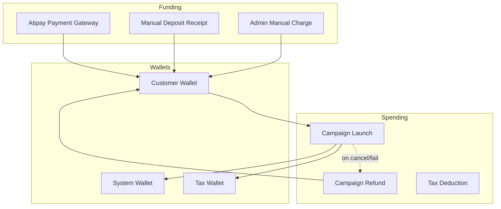
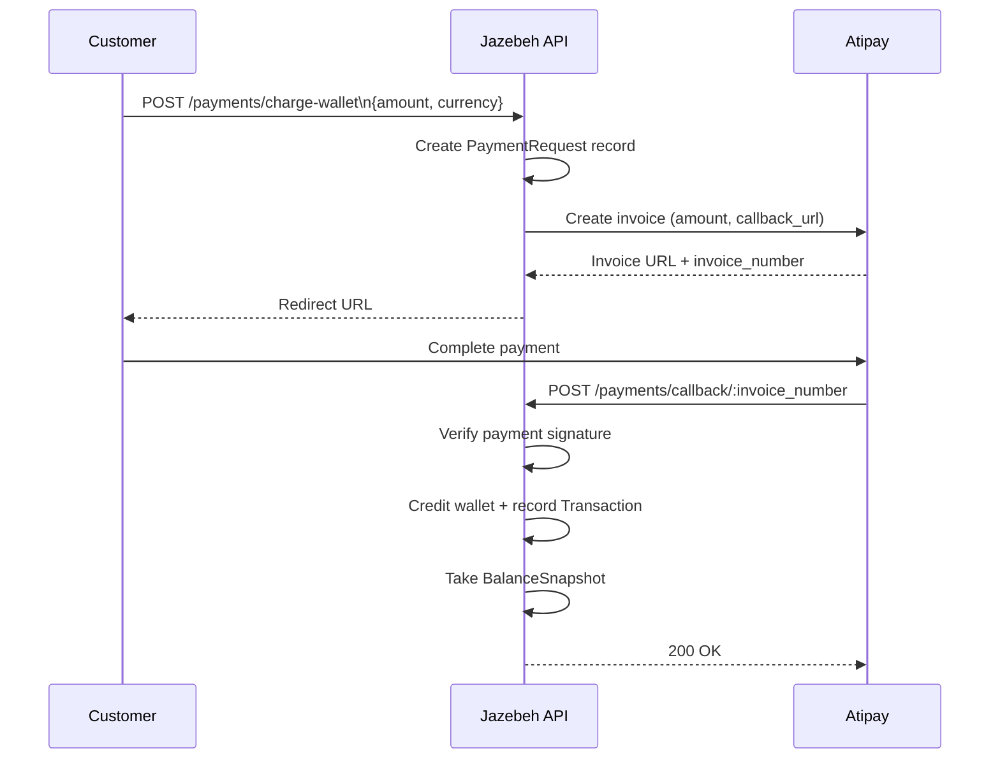
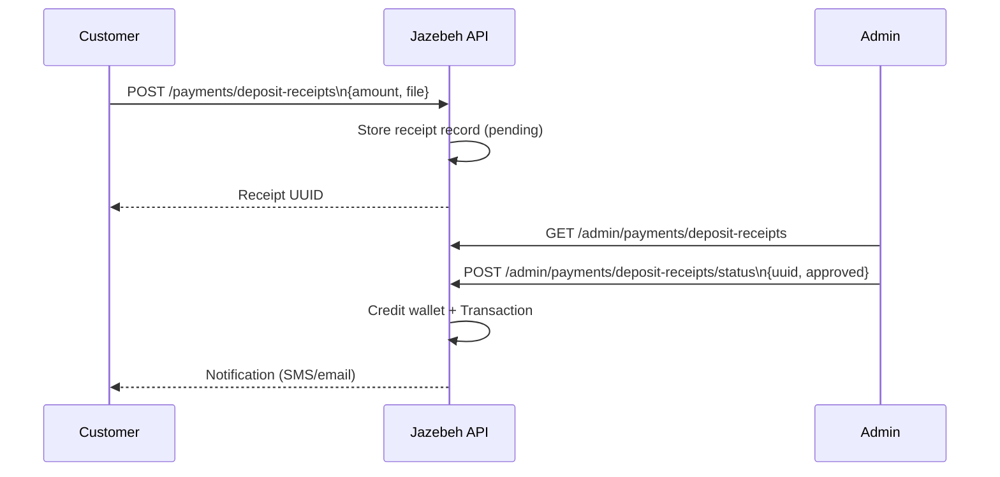
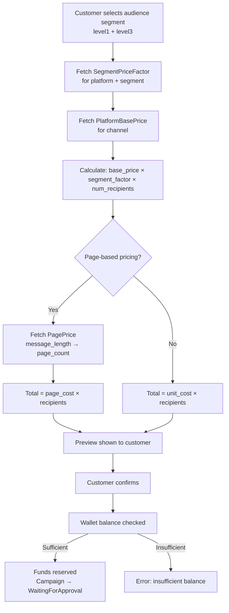
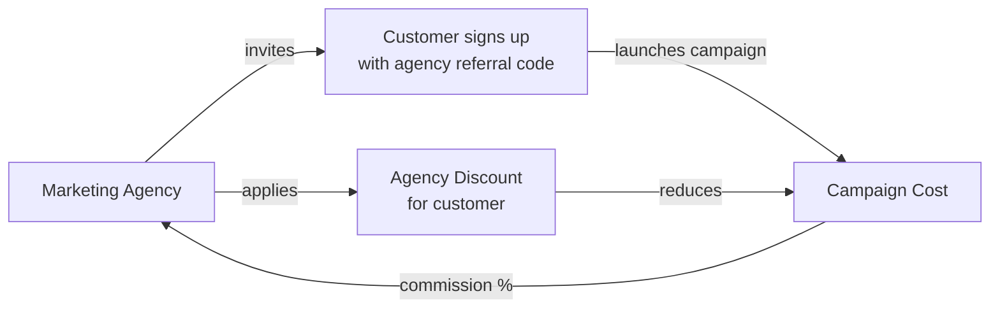

# Financial Flow — Wallet, Payments & Transactions

## Wallet Architecture

---

## Online Payment Flow (Atipay)

---

## Deposit Receipt Flow (Manual Bank Transfer)

---

## Campaign Cost Calculation

---

## Transaction Types

| Type | Direction | Description |
|---|---|---|
| `deposit` | + | Wallet top-up via payment gateway |
| `campaign_launch` | - | Funds reserved on campaign approval |
| `campaign_refund` | + | Funds returned on cancel/fail |
| `agency_commission` | + | Commission earned by agency |
| `tax` | - | Tax portion transferred to tax wallet |
| `admin_charge` | + | Manual admin credit |

---

## Agency Commission & Discount Flow

---

## Balance Snapshot

A `BalanceSnapshot` is recorded after every wallet-mutating operation (deposit, spend, refund). It captures:
- `balance` — main wallet balance
- `creditBalance` — bonus/credit balance
- `campaignBalance` — reserved for active campaigns
- `agencyBalance` — agency commission balance
- `takenAt` — UTC timestamp

This enables point-in-time balance reconciliation and audit.
