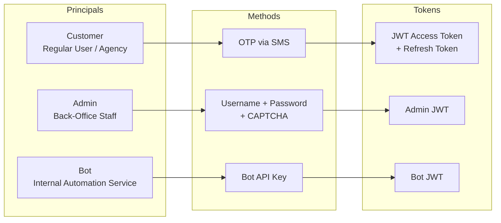
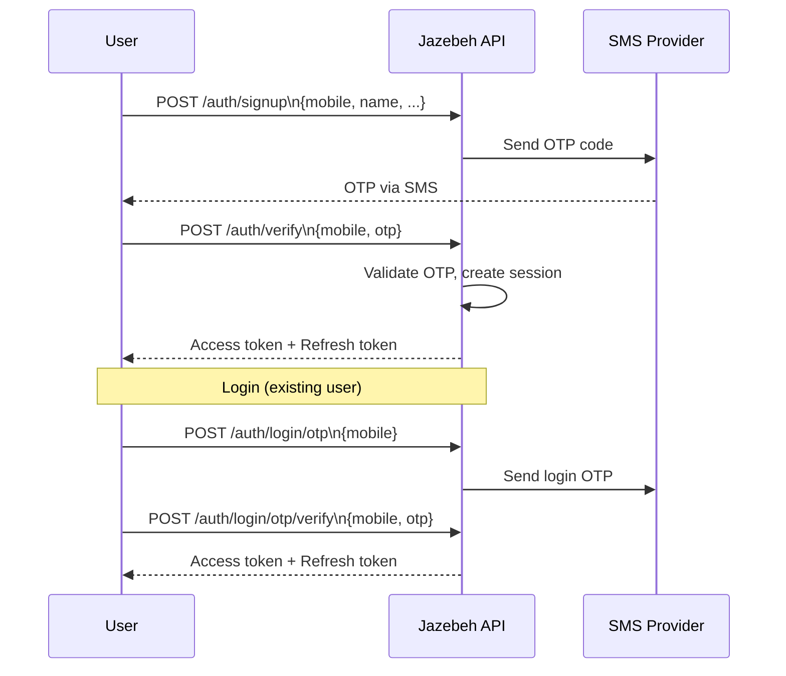
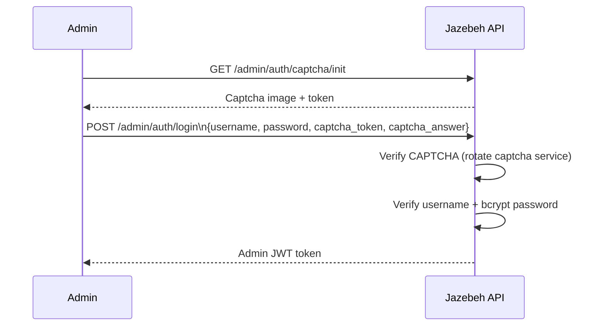
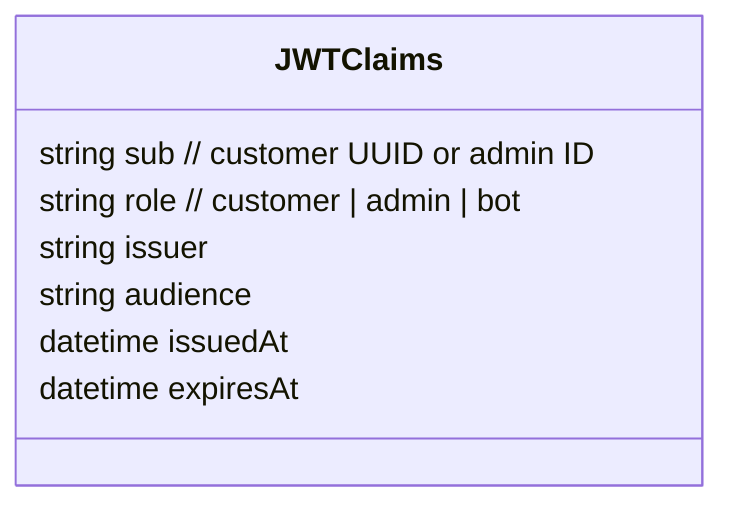
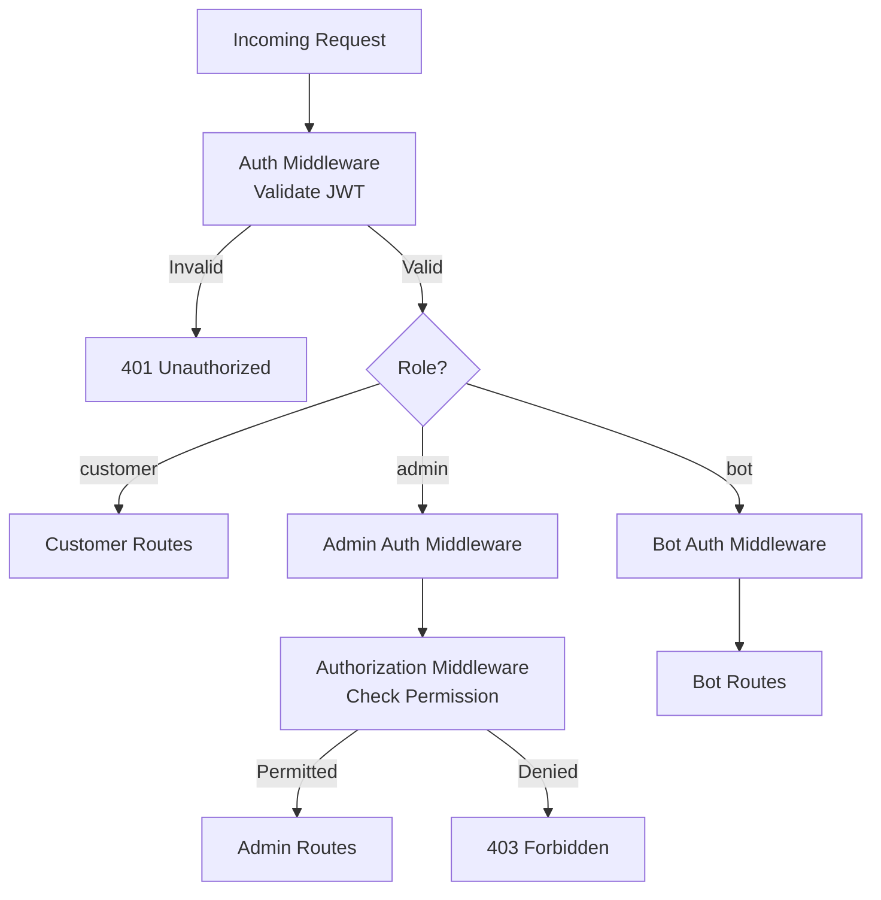
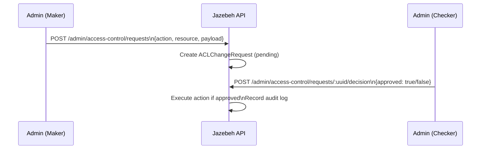
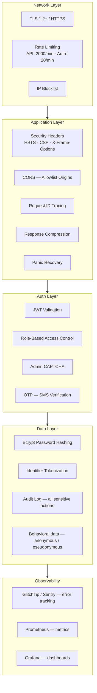

# Authentication & Security

## Authentication Roles

---

## Customer Auth Flow (OTP)

---

## Admin Auth Flow (CAPTCHA + Password)

---

## JWT Token Structure

- Supports **RSA** (asymmetric) or **HMAC** (symmetric) signing, configurable
- Access token TTL: configurable (short-lived)
- Refresh token TTL: configurable (long-lived)
- Stored in `CustomerSession` table per active session

---

## Authorization (RBAC)

Admin permissions are stored in a JSON field on the `Admin` entity and validated by `AuthorizationMiddleware` using the ACL registry.

---

## Maker-Checker (Access Control)

Sensitive admin actions (e.g., bulk charge, pricing changes) require a second admin to approve.

---

## Security Layers

---

## Audit Log

Every sensitive action produces an `AuditLog` entry with:
- `customerID` or `adminID`
- `action` (enum: signup, login, campaign_launch, payment, ...)
- `success` (bool)
- `ipAddress`
- `correlationID`
- `createdAt`

This provides a complete, immutable trail for compliance and investigation.

---

## Security Headers (Helmet)

| Header | Value |
|---|---|
| `X-XSS-Protection` | `1; mode=block` |
| `X-Content-Type-Options` | `nosniff` |
| `X-Frame-Options` | `DENY` |
| `Strict-Transport-Security` | `max-age=31536000; includeSubDomains` |
| `Content-Security-Policy` | `default-src 'self'; ...` |
| `Referrer-Policy` | `strict-origin-when-cross-origin` |
| `Cross-Origin-Opener-Policy` | `same-origin` |
