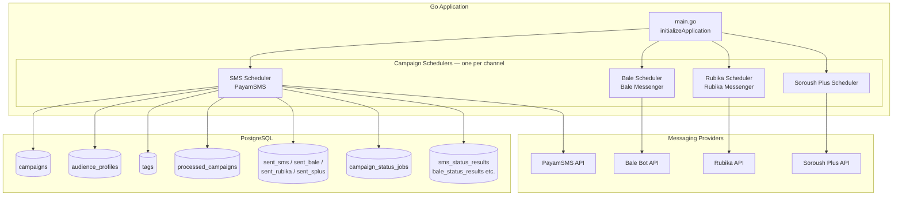
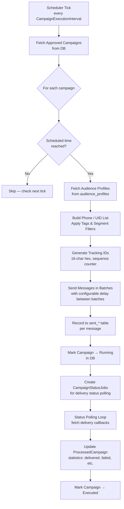
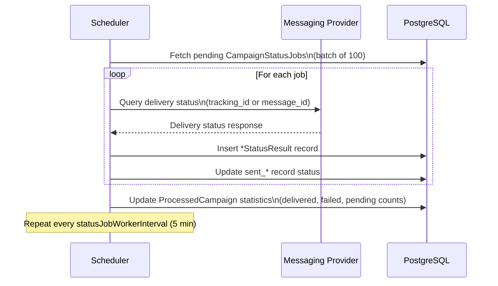
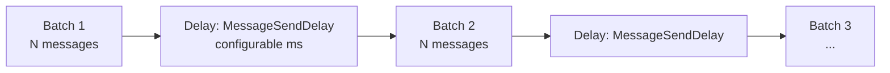
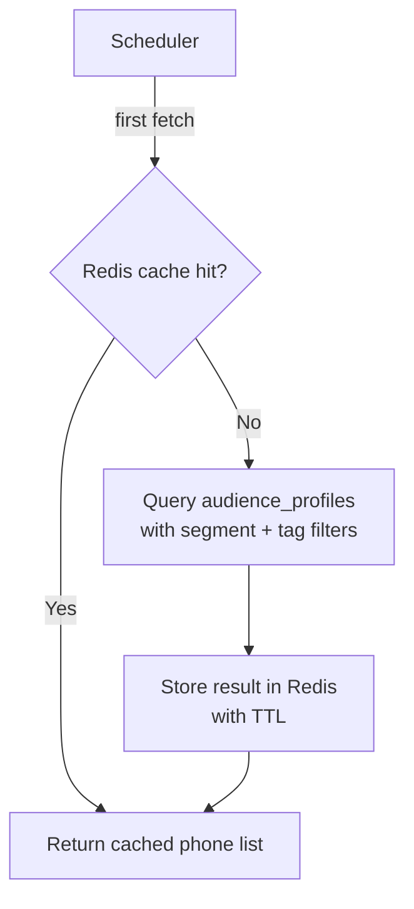

# Background Schedulers — Campaign Execution

## Scheduler Architecture

---

## Campaign Execution Loop

---

## Status Polling Loop

---

## Message Send Delay Strategy

- Prevents provider rate-limit rejections
- `MessageSendDelay` is configurable per deployment environment
- Batch size is channel-dependent (tuned per provider throughput)

---

## Channel Clients

| Scheduler | Client | Provider Type |
|---|---|---|
| `CampaignScheduler` (SMS) | `PayamSMSClient` | REST API — PayamSMS |
| `BaleCampaignScheduler` | `BaleClient` | Bot API — Bale Messenger |
| `RubikaCampaignScheduler` | Bot client | Bot API — Rubika |
| `SplusCampaignScheduler` | `SplusClient` | REST API — Soroush Plus |

Each client is initialized with per-channel credentials and timeouts from config.

---

## Audience Cache

Audience phone lists are cached in Redis to avoid repeated DB scans across scheduler ticks and retries.

---

## Graceful Stop

Each scheduler exposes a `Start(ctx) stopFunc` pattern:
- `Start()` launches goroutines for the send loop and status polling loop
- The returned `stopFunc` cancels the context, signaling goroutines to finish the current batch and exit cleanly
- Called automatically on `SIGTERM`/`SIGINT` in `main.go`
