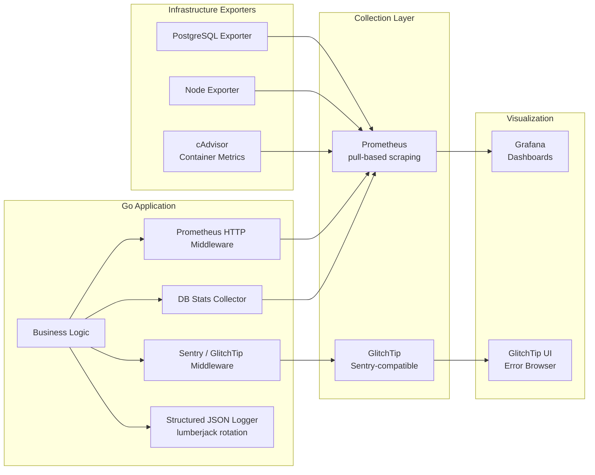
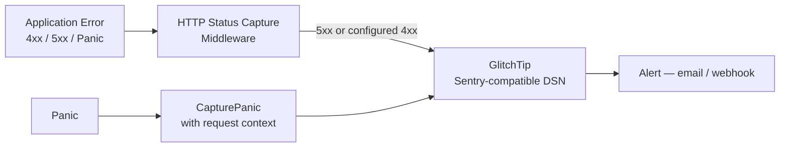

# Observability — Metrics, Logging & Error Tracking

## Observability Stack



---

## Prometheus Metrics

### Application Metrics (HTTP)

| Metric | Type | Description |
|---|---|---|
| `http_requests_total` | Counter | Total HTTP requests by method, path, status |
| `http_request_duration_seconds` | Histogram | Request latency distribution |
| `http_active_requests` | Gauge | In-flight requests |

### Database Connection Pool Metrics

| Metric | Type | Description |
|---|---|---|
| `db_open_connections{name}` | Gauge | Total open DB connections |
| `db_in_use_connections{name}` | Gauge | Connections currently in use |
| `db_idle_connections{name}` | Gauge | Idle connections |
| `db_wait_count_total{name}` | Counter | Connections waited for |
| `db_wait_duration_seconds_total{name}` | Counter | Total time waiting for connection |
| `db_max_open_connections{name}` | Gauge | Configured max open connections |

### Go Runtime Metrics (via GoCollector)

- Goroutine count, memory allocations, GC pauses, heap size

### Infrastructure Metrics

| Exporter | Key Metrics |
|---|---|
| PostgreSQL Exporter | Query duration, replication lag, connection counts, table bloat |
| Node Exporter | CPU, memory, disk I/O, network |
| cAdvisor | Container CPU/memory, container restarts |

---

## Error Tracking (GlitchTip / Sentry)



Configuration flags:
- `Capture4xx` — enable/disable capturing 4xx errors
- `Capture5xx` — enable/disable capturing 5xx errors
- GlitchTip is self-hosted in the same Docker network

---

## Structured Request Logging

Every request produces a JSON log line:

```json
{
  "time": "2025-05-20T10:00:00Z",
  "pid": "1234",
  "request_id": "a3f9c12e8b7d4a1f",
  "level": "info",
  "method": "POST",
  "path": "/api/v1/campaigns",
  "protocol": "HTTP/1.1",
  "ip": "10.0.0.5",
  "user_agent": "Mozilla/5.0",
  "status": 201,
  "latency": "45ms",
  "bytes_in": 512,
  "bytes_out": 1024,
  "referer": ""
}
```

- Logs written to rotating files via **lumberjack** (`data/app.log`)
- Health check endpoint (`/api/v1/health`) excluded from access logs to reduce noise
- Each request carries `X-Request-ID` header for distributed tracing

---

## Scheduler Logging

Each campaign scheduler writes to a dedicated log file:

| Scheduler | Log File |
|---|---|
| SMS | `data/sms_scheduler.log` |
| Bale | `data/bale_scheduler.log` |
| Rubika | `data/rubika_scheduler.log` |
| Soroush Plus | `data/splus_scheduler.log` |

---

## Alert Rules (Prometheus → Grafana)

| Condition | Severity | Action |
|---|---|---|
| Error rate > 5% over 5 min | Warning | Dashboard alert |
| DB connection pool exhausted | Critical | Page on-call |
| Redis ping failure | Critical | Page on-call |
| TLS cert expires < 14 days | Warning | Email alert (CertMonitor) |
| Container restart detected | Warning | Dashboard alert |

---

## Availability Target

- **Pilot target**: ≥ 99% availability
- Health check: `GET /api/v1/health` — used by nginx upstream health probe and external monitors
