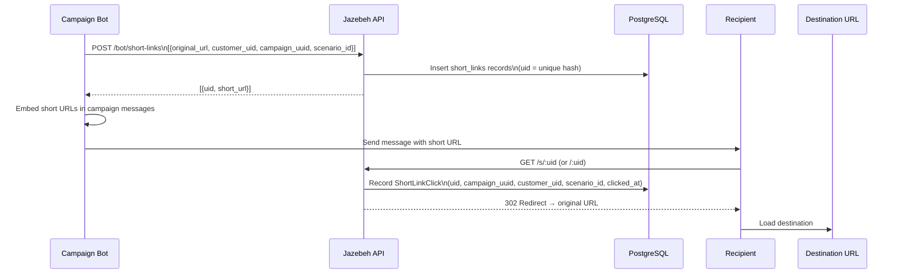
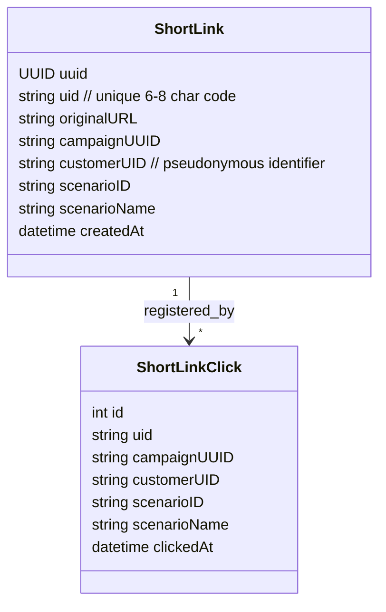
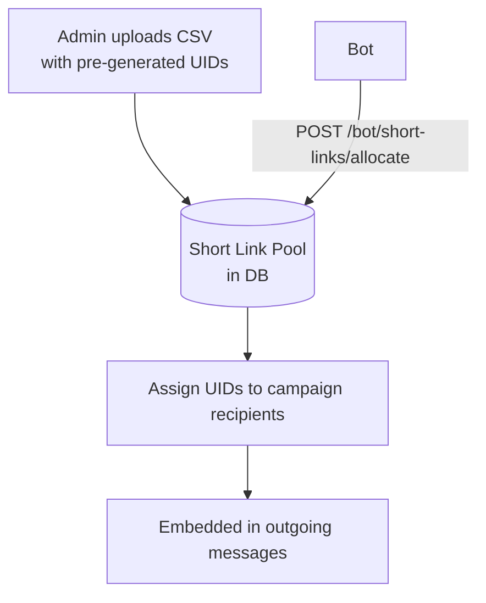
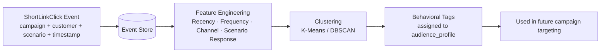

# Short Links & UTM Tracking

## Overview

The short link / UTM tracker converts long campaign URLs into unique per-recipient short links. When a recipient clicks, the platform records the event anonymously and redirects to the original URL. This feeds into the behavioral profiling pipeline.

---

## Short Link Lifecycle

---

## Short Link Entity

---

## Allocation Model

For large campaigns, UIDs are pre-allocated from a pool. The bot requests a bulk allocation and receives a reserved set of UIDs mapped to recipient identifiers.

---

## Click Denormalization

Click records are **denormalized** — the `short_link_clicks` table stores `campaign_uuid`, `customer_uid`, `scenario_id`, and `scenario_name` directly (copied from the short link at insert time). This allows efficient analytics queries without joining `short_links` on every click lookup.

Migration `0053_denormalize_short_link_clicks.sql` introduced this optimization, backfilled by `0054`.

---

## UTM Tracking → Behavioral Pipeline

---

## Admin Reporting (Short Links)

| Endpoint | Output |
|---|---|
| `POST /admin/short-links/download` | Excel: all links for a scenario |
| `POST /admin/short-links/download-with-clicks` | Excel: links + click counts |
| `POST /admin/short-links/download-with-clicks-range` | Excel: links + clicks in date range |
| `POST /admin/short-links/download-with-clicks-by-scenario-name` | Excel: by scenario name |

---

## Privacy Design

- `customerUID` is a **pseudonymous** identifier — not a real name or phone number
- Click data is linked to campaigns and scenarios, not to personally identifiable fields
- No IP address or user-agent is stored in `short_link_clicks` (removed in migration `0046`)
- Fully compliant with the platform's anonymous behavioral data policy
