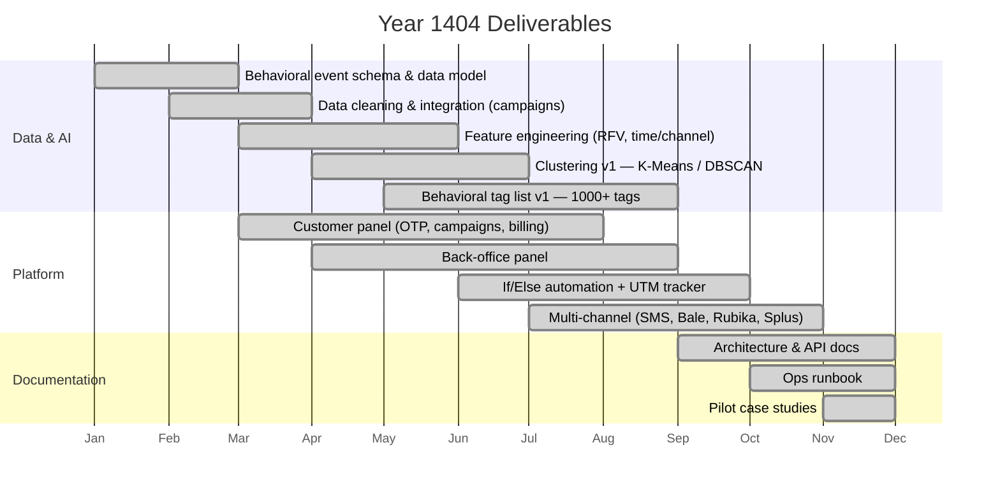
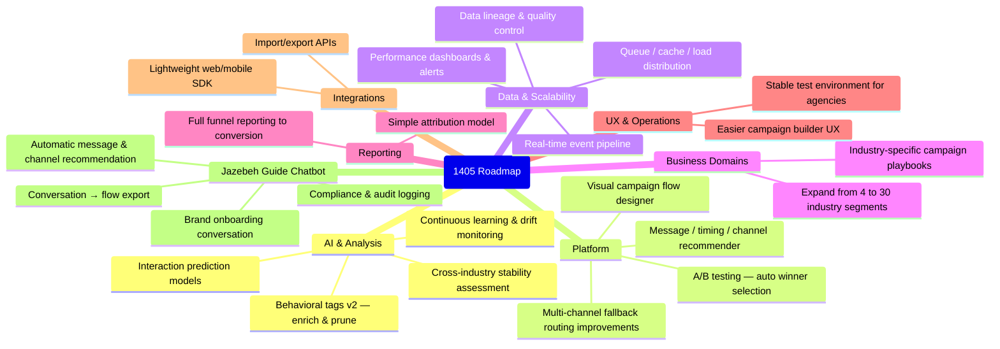

# Roadmap — Completed & Planned

## Completed (Year 1404)

---

## Planned (Year 1405)

---

## Current Status Summary

| Area | Status |
|---|---|
| Customer Panel | Stable pilot |
| Back-Office Panel | Stable pilot |
| SMS Channel | Production |
| Bale Messenger | Production |
| Rubika Messenger | Production |
| Soroush Plus | Production |
| Behavioral Tags v1 | Complete (1000+ tags) |
| Clustering v1 | Complete |
| UTM / Short Link Tracker | Production |
| Online Payments (Atipay) | Production |
| Manual Deposit Receipts | Production |
| Agency Sub-account System | Production |
| Support Tickets | Production |
| Prometheus / Grafana | Production |
| GlitchTip Error Tracking | Production |
| Interaction Prediction Models | Planned (1405) |
| Flow Designer | Planned (1405) |
| A/B Testing | Planned (1405) |
| Jazebeh Guide Chatbot | Planned (1405) |

---

## Quality Targets

| Metric | Target | Notes |
|---|---|---|
| Platform availability | ≥ 99% | Pilot period |
| Clustering Silhouette score | ≥ 0.45 | v1 models |
| Behavioral tag coverage | ≥ 60% of valid data | v1 |
| CTR/LTR improvement vs baseline | ≥ 2× | Pilot campaigns |
| Prediction AUC (future) | ≥ 0.75 | v2 models |
| Drift detection alert latency | < 15 min | Real-time path |
| Recommendation response time (MVP) | < 4 sec | |
| Recommendation response time (advanced) | < 500 ms | |
| Campaign flow change application | < 1 sec | Future |
| Channel failover time | < 3 sec | Future |
