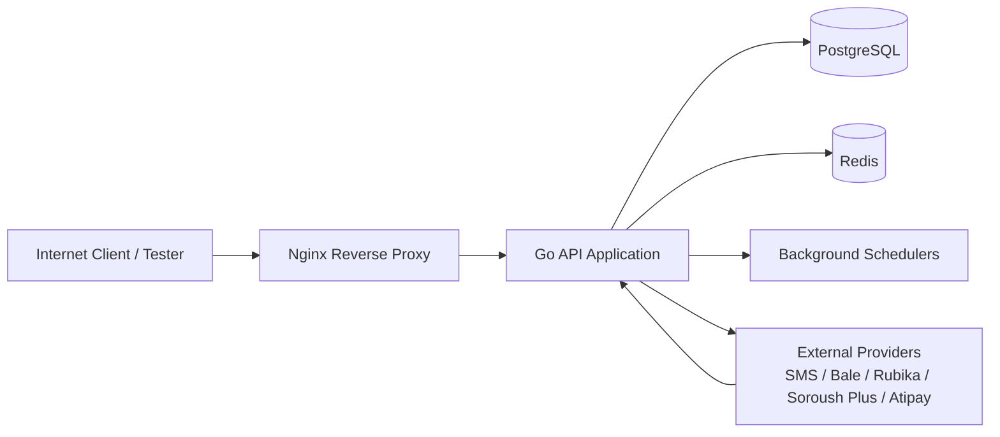

# Pentest Handoff

This document is the pentest-oriented companion to the architecture, deployment, auth, API, and scheduler references in this directory.

It answers the practical questions a pentest team usually asks first:
- What is in scope?
- Which hosts and routes are externally reachable?
- Which roles exist for testing?
- Which components are internal only?
- Which third-party integrations exist and how should they be treated?

Use this together with:
- [01-architecture.md](01-architecture.md)
- [05-deployment.md](05-deployment.md)
- [07-auth-security.md](07-auth-security.md)
- [08-api-reference.md](08-api-reference.md)
- [09-scheduler.md](09-scheduler.md)

---

## Scope Summary

| Area | In Scope | Notes |
|---|---|---|
| Public web application | Yes | Main customer-facing web app and its authenticated features |
| Public API under `/api/v1` | Yes | Customer, admin, bot-auth, and payment callback routes |
| Public short-link redirects | Yes | `/s/:uid`, `/:uid`, `/s/tst:uid`, `/tst:uid` |
| Authentication and session flows | Yes | Customer OTP/password, admin CAPTCHA/password/OTP, bot login |
| Authorization and role separation | Yes | Customer vs admin vs bot access boundaries |
| File upload and download flows | Yes | Media and receipt file handling |
| Payment flows | Yes | Wallet charge, deposit receipts, callback/webhook handling |
| Campaign management flows | Yes | Create, approve, run, cancel, export, statistics update |
| Background schedulers | Partially | Validate trust boundaries and bot/API interactions; do not attack third-party providers |
| Monitoring UIs | Environment-dependent | Confirm explicitly before testing `monitoring` and `sentry` hosts |
| Third-party providers | No direct testing by default | Only test our integration points, callbacks, and input handling |

---

## Target Hosts

The repository documents the following hostnames and exposure model:

| Host / Surface | Exposure | Purpose |
|---|---|---|
| `https://jazebeh.ir` | Public | Main web application and API entrypoint |
| `https://www.jazebeh.ir` | Public | Alias for main domain |
| `https://landing.jazebeh.ir` | Public redirect | Redirects to `/landing` on the main domain |
| `https://monitoring.jazebeh.ir` | Restricted by engagement decision | Monitoring UI surface if exposed in the target environment |
| `https://sentry.jazebeh.ir` | Restricted by engagement decision | Error-tracking UI surface if exposed in the target environment |

API routing is path-based under the main application host:
- Base path: `/api/v1`
- Public short-link redirects live at root level, not under `/api/v1`

If the engagement is limited to a staging or beta environment, replace the production hostnames above with the exact test hostnames before sharing this file.

---

## Publicly Reachable Routes

These routes are intentionally reachable without a prior authenticated session.

### Public application endpoints

| Method | Path | Purpose |
|---|---|---|
| `GET` | `/health` | Reverse-proxy health probe to application health |
| `GET` | `/s/:uid` | Public short-link redirect |
| `GET` | `/:uid` | Public short-link redirect |
| `GET` | `/s/tst:uid` | Public test short-link redirect |
| `GET` | `/tst:uid` | Public test short-link redirect |

### Public API endpoints

| Method | Path | Purpose |
|---|---|---|
| `POST` | `/api/v1/auth/signup` | Customer registration |
| `POST` | `/api/v1/auth/verify` | OTP verification |
| `POST` | `/api/v1/auth/resend-otp` | OTP resend |
| `POST` | `/api/v1/auth/login` | Customer password login |
| `POST` | `/api/v1/auth/login/otp` | OTP login initiation |
| `POST` | `/api/v1/auth/login/otp/verify` | OTP login completion |
| `POST` | `/api/v1/auth/forgot-password` | Password reset initiation |
| `POST` | `/api/v1/auth/reset` | Password reset completion |
| `GET` | `/api/v1/admin/auth/captcha/init` | Admin CAPTCHA bootstrap |
| `POST` | `/api/v1/admin/auth/login` | Admin password login step |
| `POST` | `/api/v1/admin/auth/login/verify-otp` | Admin OTP completion step |
| `POST` | `/api/v1/bot/auth/login` | Bot credential exchange for JWT |
| `POST` | `/api/v1/payments/callback/:invoice_number` | Payment gateway callback |

All other `/api/v1` routes are intended to require valid authentication and role checks.

---

## Internal or Restricted Surfaces

These surfaces are documented in the repository but are not intended to be internet-accessible to unauthenticated users.

| Surface | Expected Access |
|---|---|
| Application container port `:8080` | Internal only, behind Nginx |
| PostgreSQL `:5432` | Internal only |
| Redis `:6379` | Internal only |
| Prometheus metrics `/metrics` | Restricted to localhost / internal Docker network |
| Exporters and observability collectors | Internal only |
| Background scheduler loops | Internal worker behavior, triggered through application state not direct public exposure |

Per the Nginx configuration, `/metrics` is allowlisted for `127.0.0.1` and the internal Docker subnet and denied to everyone else.

---

## Roles for Testing

The platform has three security principals:

| Role | Purpose | Typical Attack Focus |
|---|---|---|
| Customer | Self-service campaign user or agency user | Account takeover, IDOR, pricing/balance abuse, file access, report export, tenant isolation |
| Admin | Back-office operator | Privilege escalation, broken authorization, maker-checker bypass, mass-action abuse |
| Bot | Internal automation actor | Machine-to-machine auth, replay, over-privileged service actions, forged statistics/status updates |

### Minimum test accounts to provision

Provide these accounts to the pentest team before testing starts:

| Account Type | Count | Notes |
|---|---|---|
| Customer account | 2 | Separate tenants for cross-tenant authorization testing |
| Agency account | 1 | Should own at least one sub-account |
| Admin account with limited permissions | 1 | For broken access control checks |
| Admin account with broader permissions | 1 | For privilege-separation and maker-checker tests |
| Bot credentials | 1 | Test-only bot user with non-production secrets |

Fill these before sharing:

| Item | Value |
|---|---|
| Test environment base URL | `TODO` |
| Customer account A | `TODO` |
| Customer account B | `TODO` |
| Agency account | `TODO` |
| Limited admin account | `TODO` |
| Privileged admin account | `TODO` |
| Bot username | `TODO` |
| Bot password or token handoff method | `TODO` |
| OTP delivery method for testers | `TODO` |
| Test callback allowlist / source IP requirements | `TODO` |

Do not provide production secrets, production admin credentials, or copied values from deployment notes.

---

## Trust Boundaries

Primary boundaries to validate:
- Internet to reverse proxy
- Reverse proxy to application route protection
- Customer to customer tenant boundary
- Customer to admin privilege boundary
- Admin to sensitive action approval boundary
- Public webhook entrypoints to internal state-changing operations
- Bot credential boundary for scheduler-facing operations

---

## High-Risk Workflows

These flows deserve explicit coverage during testing.

| Workflow | Why It Matters |
|---|---|
| Customer registration, login, password reset, OTP verification | Account takeover and OTP abuse risk |
| Admin login with CAPTCHA and OTP | Administrative access compromise |
| Campaign creation, approval, cancellation, rescheduling | Business logic abuse and privilege bypass |
| Export endpoints | Insecure direct object reference and mass data exposure |
| Wallet charge, deposit receipt upload, invoice issuance | Financial fraud and broken authorization |
| Payment callbacks | Forged or replayed webhook risk |
| Media upload and preview/download | Content-type confusion, file exposure, malicious upload handling |
| Agency and sub-account reporting | Cross-tenant data leakage |
| Short-link redirects and click tracking | Open redirect, enumeration, tracking-data exposure |
| Bot statistics/status update endpoints | Forged delivery state and unauthorized campaign mutation |

---

## Third-Party Integrations

These services are integrated by the platform but should not be attacked directly unless the engagement explicitly includes them.

| Integration | Role in System | Pentest Handling |
|---|---|---|
| PayamSMS | SMS delivery / OTP | Test only our request handling, credential use, and response validation |
| Bale | Messaging provider | Test our integration paths only |
| Rubika | Messaging provider | Test our integration paths only |
| Soroush Plus | Messaging provider | Test our integration paths only |
| Atipay | Payment gateway | Test callback validation and transaction state handling |

Preferred practice for callbacks and provider flows:
- Use sandbox/test credentials where available
- Use tester-controlled callback payloads only against the designated test environment
- Do not send abusive traffic to provider-owned infrastructure

---

## Expected Security Controls

The pentest team should expect to observe these controls in the target environment:
- TLS termination at Nginx
- Rate limiting on general API traffic and stricter limits on auth routes
- JWT-based authentication for customer, admin, and bot sessions
- Role-based authorization for admin and bot routes
- Security headers including HSTS, CSP, `X-Frame-Options`, and `nosniff`
- Request correlation IDs and audit logging for sensitive actions
- Restricted metrics exposure

If any of these are absent in the test environment, treat that as an environment drift finding rather than assuming the design intended it.

---

## Out of Scope by Default

Unless the engagement says otherwise, keep these out of scope:
- Denial-of-service / volumetric testing
- Social engineering
- Physical security
- Direct attacks on cloud, ISP, SMS, payment, or chat-provider infrastructure
- Source-code review of secrets accidentally present in operational notes
- Production data exfiltration attempts outside the designated test environment

---

## Handoff Checklist

Before sending this package to the pentest team, complete this checklist:

- Confirm the exact target environment and replace all `TODO` placeholders
- Provide dedicated test accounts for customer, agency, admin, and bot roles
- Confirm whether `monitoring` and `sentry` hosts are in scope
- Confirm whether payment callbacks should be tested with sandbox credentials
- Confirm any source-IP allowlists or WAF rules that may block testers
- Confirm the approved testing window and contact path for critical findings
- Remove any accidental secrets from adjacent documents before sharing the package
