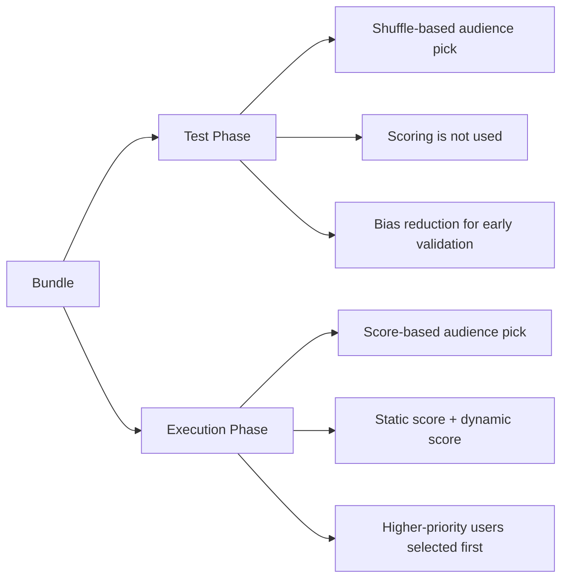

# Bundles, Test Phase, and Scoring

## What a Bundle Means

A **bundle** groups multiple related campaigns under one audience-allocation rule.

The key rule is simple:

- A phone number can be used only once inside the same bundle.
- This rule applies across both phases: `test` and `execution`.
- If a user has already been selected by an earlier campaign in the bundle, that user is excluded from later campaigns in the same bundle.

This prevents repeated targeting of the same person across a coordinated campaign set.

---

## Two Phases, Two Selection Strategies

---

## Test Phase

In the **test phase**, the scoring feature is **not used**.

Instead, users are selected after a **shuffle procedure**. The purpose is to avoid overfitting the test to only high-score or low-score users and to reduce selection bias during early validation.

This means the test phase is designed to answer:

- Does the message render correctly?
- Does the link flow work correctly?
- Does the campaign logic behave as expected on a neutral sample?

---

## Execution Phase

In the **execution phase**, the scoring feature **is used**.

At this stage, users are selected according to a score assigned to each user. That score is the combination of:

- A **static score**
- A **dynamic score**

The static score represents the user's more stable, long-lived relevance signals.  
The dynamic score captures changing or time-sensitive signals.

Together, these produce the effective audience priority used during campaign execution.

---

## Why This Design Works

| Concern | Test Phase | Execution Phase |
|---|---|---|
| Selection method | Shuffle | Score-based |
| Scoring used | No | Yes |
| Main goal | Reduce bias and validate setup | Maximize campaign effectiveness |
| Audience uniqueness in bundle | Enforced | Enforced |

This separation gives the platform two advantages:

- **Fair testing** before launch
- **Performance-focused targeting** during real execution

---

## Bundle-Level Uniqueness Rule

The phone-number uniqueness rule is enforced at the **bundle level**, not just at the single-campaign level.

So if a phone number appears in:

1. A test campaign inside a bundle
2. An execution campaign inside the same bundle

that phone number is still considered **already used** and will not be selected again inside that bundle.

This ensures:

- less audience fatigue
- cleaner measurement across campaign steps
- no duplicate delivery inside the same bundle strategy
