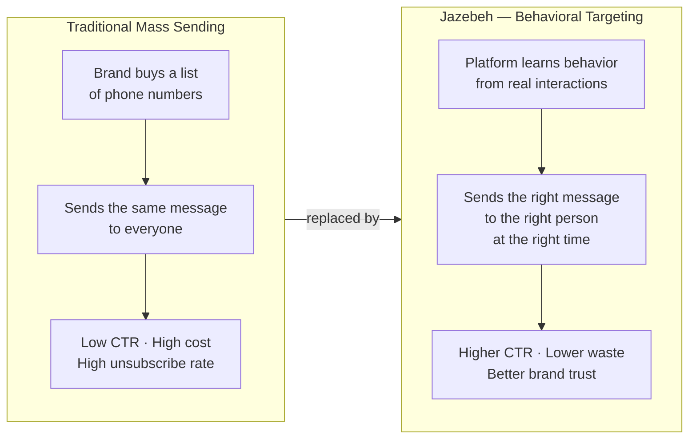
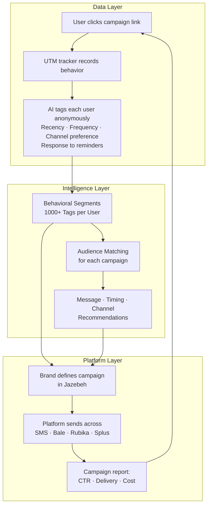
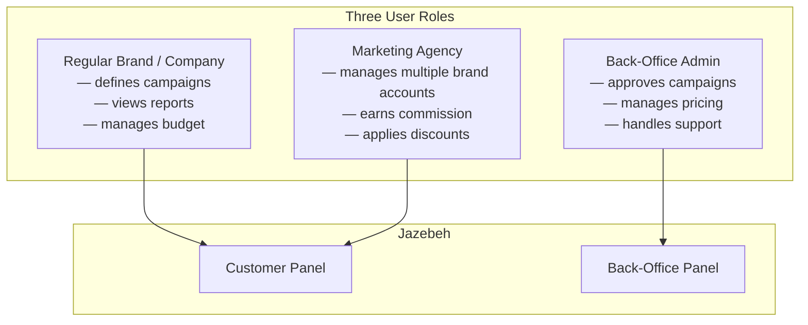
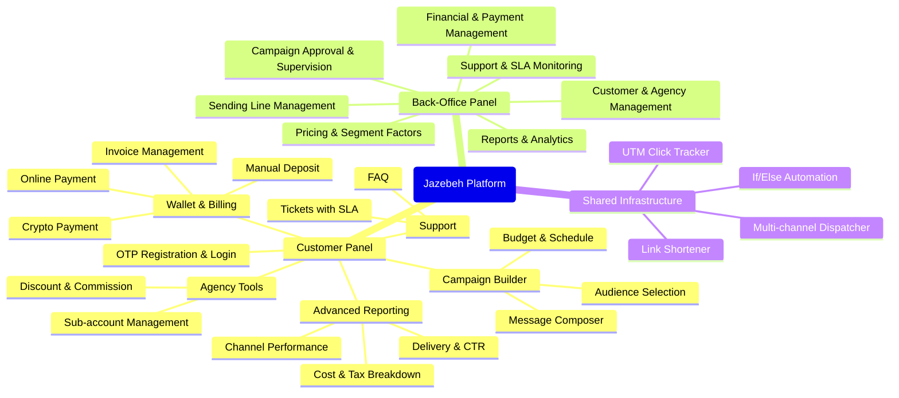
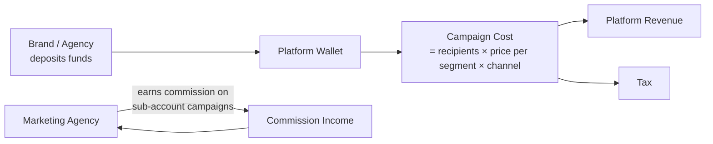
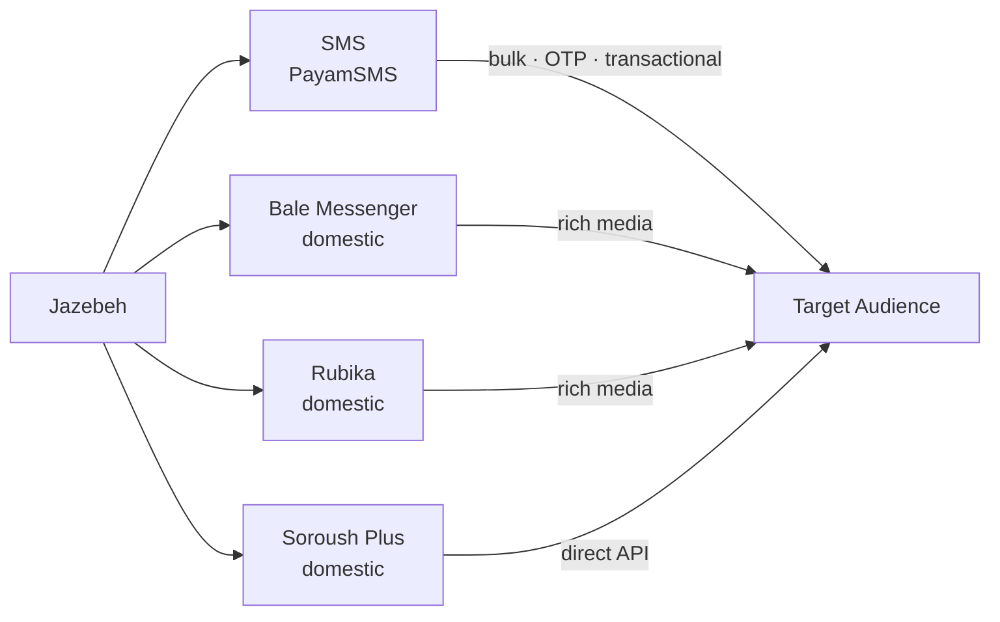
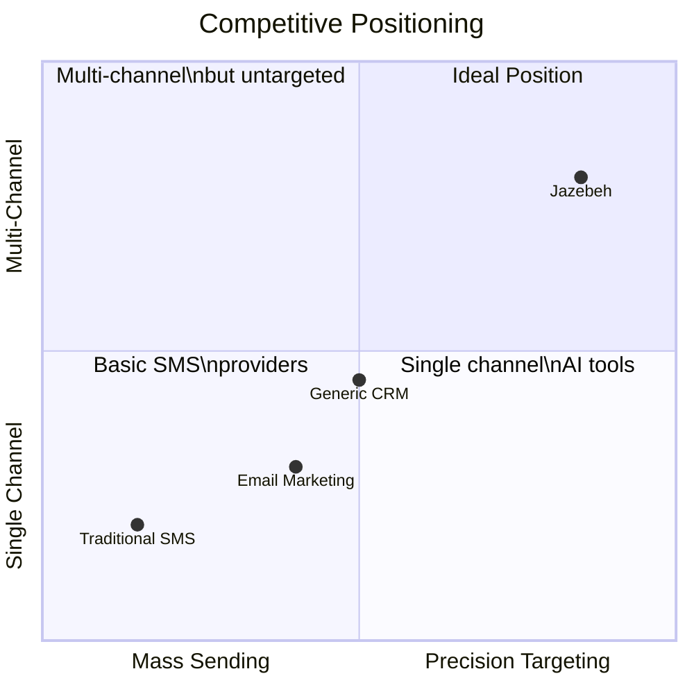

# Jazebeh Platform — Business Overview for Investors

---

## The Problem We Solve

---

## How Value Is Created

---

## Who Uses the Platform

---

## Platform Module Map

---

## Revenue Model

**Pricing levers:**
- Base price per channel (SMS / Bale / Rubika / Soroush Plus)
- Segment price factor — premium audiences cost more
- Page-based pricing for multi-page messages
- Agency discounts and coupon management

---

## Supported Channels

**Channel-independent layer:** if one channel fails, the platform automatically switches — route-switch in under 3 seconds.

---

## Competitive Differentiation

