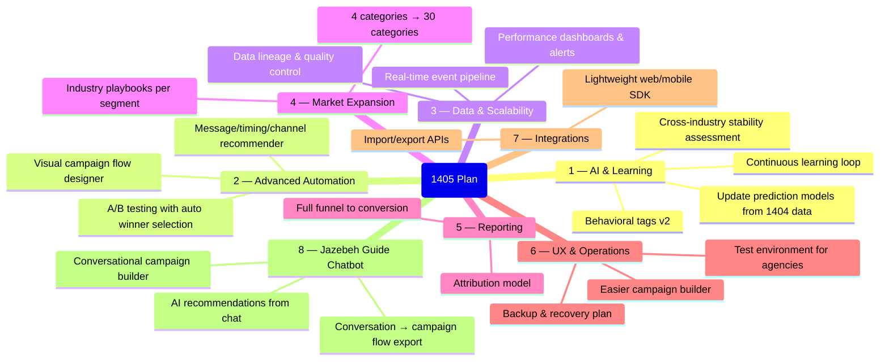
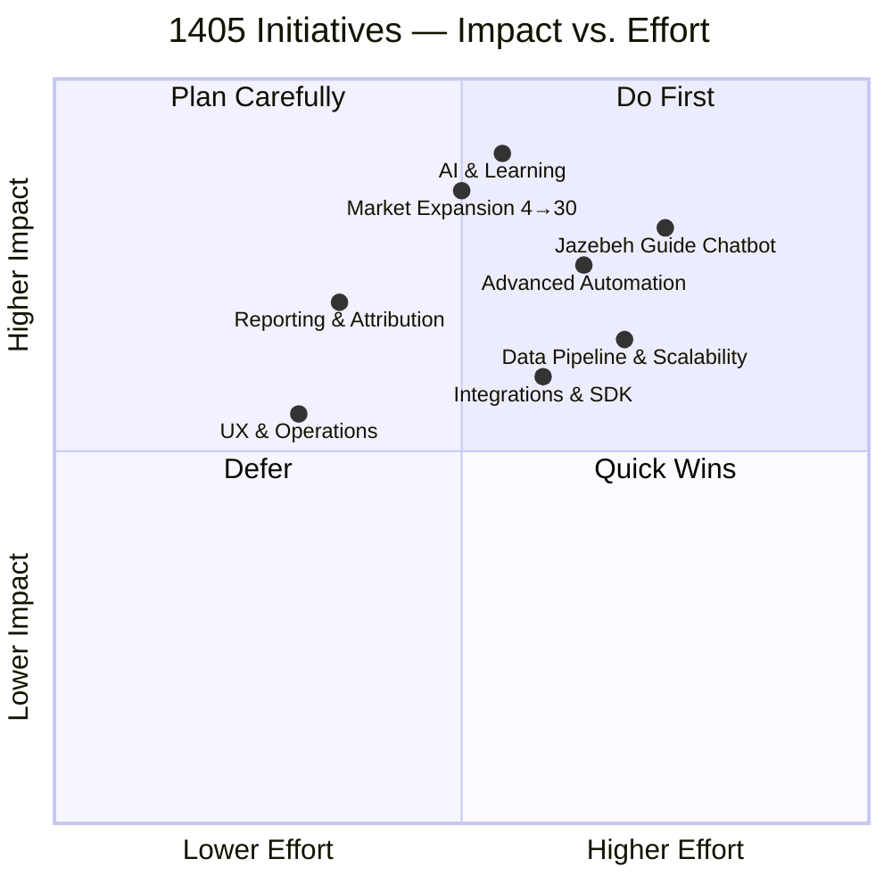
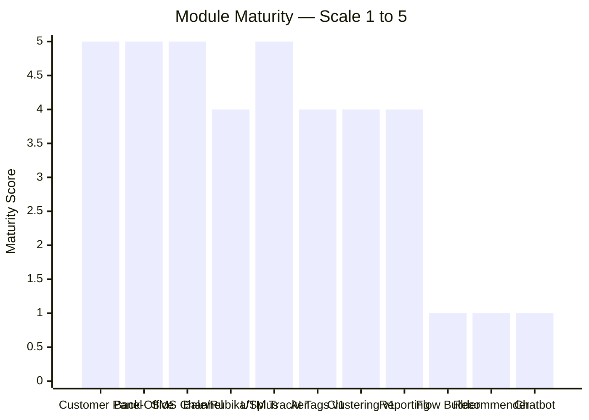
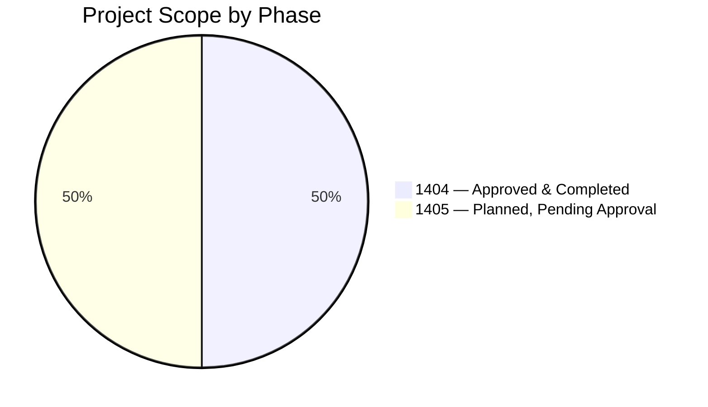

# Deliverables & Roadmap — Board Review

---

## Year 1404: Everything Promised, Everything Delivered

```mermaid
gantt
    title Year 1404 — Delivery Timeline
    dateFormat YYYY-Q
    axisFormat Q%q

    section AI & Behavioral Profiling
    Behavioral event schema & data model        :done, 2024-Q1, 1q
    Data cleaning — hundreds of campaigns       :done, 2024-Q1, 2q
    Feature engineering (RFV, time, channel)    :done, 2024-Q2, 2q
    Clustering v1 — K-Means / DBSCAN            :done, 2024-Q2, 2q
    Behavioral tag list v1 — 1,000+ tags        :done, 2024-Q3, 1q
    Model Cards & evaluation report             :done, 2024-Q3, 1q

    section Platform
    Customer panel (OTP, campaigns, billing)    :done, 2024-Q2, 2q
    Back-office panel (all modules)             :done, 2024-Q2, 2q
    If/Else automation + UTM tracker            :done, 2024-Q3, 1q
    Multi-channel (SMS · Bale · Rubika · Splus) :done, 2024-Q3, 2q
    Platform stabilization & UX improvement     :done, 2024-Q4, 1q

    section Documentation & Pilots
    Controlled pilots — 4 business categories   :done, 2024-Q3, 2q
    Architecture & API documentation            :done, 2024-Q4, 1q
    Ops runbook (monitoring, backup, restore)   :done, 2024-Q4, 1q
    Pilot case studies                          :done, 2024-Q4, 1q
```

---

## 1404 Commitments vs. Actuals

| Commitment | Target | Delivered |
|---|---|---|
| Behavioral tag list | ≥ 1,000 tags | ✅ Done |
| Clustering model | K-Means / DBSCAN with Model Cards | ✅ Done |
| Customer panel modules | OTP · Campaigns · Billing · Support | ✅ Done |
| Back-office modules | Approval · Pricing · Payments · Reports | ✅ Done |
| Messaging channels | SMS + domestic messengers | ✅ Done (4 channels) |
| UTM / link tracker | Unique per-user campaign links | ✅ Done |
| Controlled pilots | 4 business categories | ✅ Done |
| Documentation package | Architecture · Ops · User guide | ✅ Done |

**Result: 100% of approved 1404 scope delivered on time.**

---

## Year 1405: Eight Growth Initiatives



---

## Initiative Prioritization (Impact vs. Effort)



---

## Product Maturity by Module



*Score: 5 = Production · 4 = Pilot · 3 = Beta · 2 = Prototype · 1 = Planned*

---

## Budget Scope: Approved vs. Planned



> The 1404 approved scope was **fully completed**. The 1405 scope was defined in the original project plan and is **pending approval for funding**.
