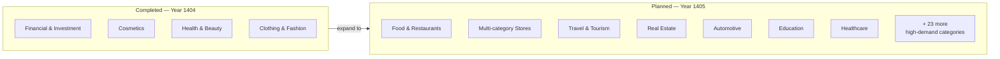
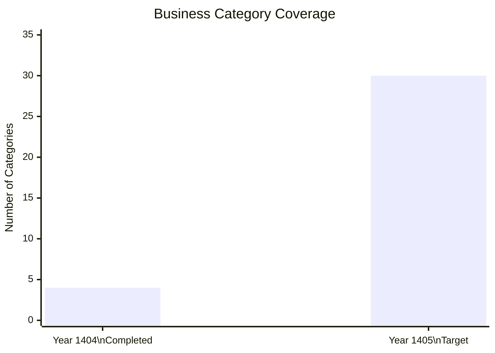
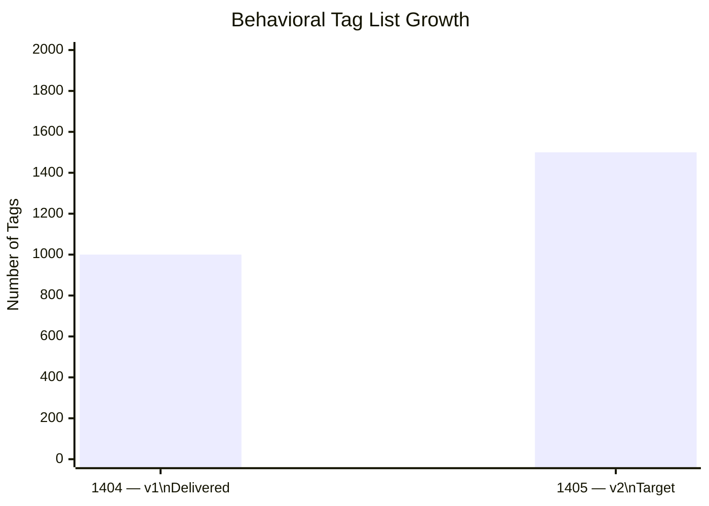
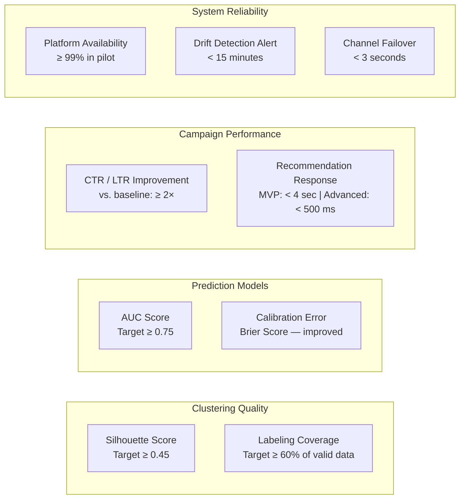
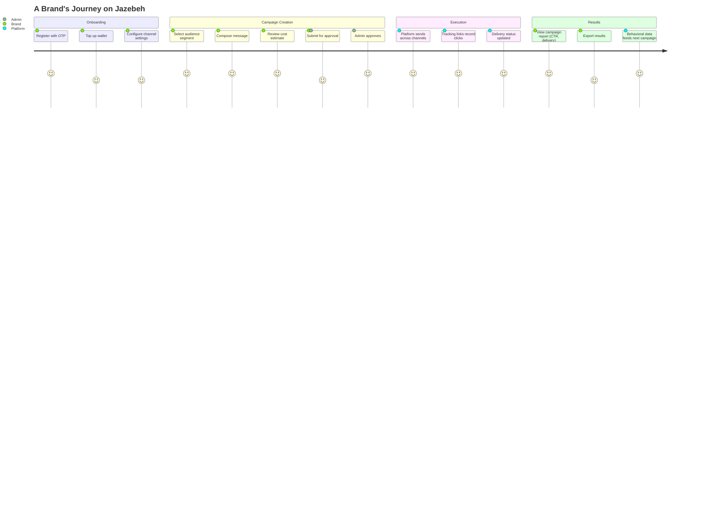
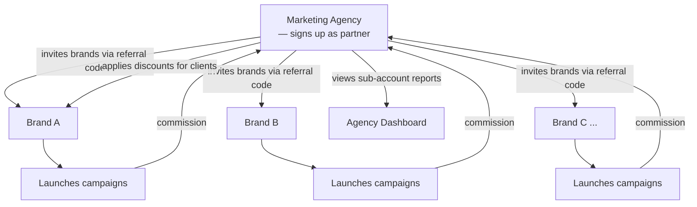
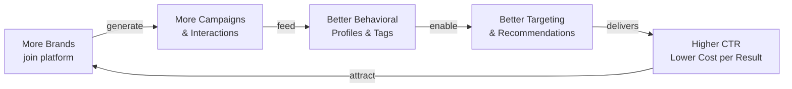

# Market Coverage & Key Performance Indicators

---

## Market Expansion: 4 → 30 Business Categories

---

## Category Coverage Growth

Each category includes:
- Operational behavioral segment outputs (tagged audience profiles)
- Ready-to-use campaign playbook (message templates, timing, frequency, channels)

---

## Behavioral Tag Growth

Tags v2 adds:
- Low-impact tags removed
- Use cases clarified per real campaign scenario
- Cross-industry tags for multi-sector stability

---

## Quality KPI Targets

---

## KPI Dashboard (Current vs. Target)

| KPI | Category | Current (1404) | Target (1405) |
|---|---|---|---|
| Business categories covered | Market | 4 | 30 |
| Behavioral tags | AI | 1,000+ | 1,500+ |
| Clustering Silhouette score | AI | Established | ≥ 0.45 |
| Tag labeling coverage | AI | Established | ≥ 60% |
| CTR/LTR improvement vs. baseline | AI | Measured | ≥ 2× |
| Prediction AUC | AI | — | ≥ 0.75 |
| Recommendation response time | Platform | — | < 500 ms |
| Platform availability | Platform | Pilot | ≥ 99% |
| Drift detection alert | Platform | — | < 15 min |
| Channel failover time | Platform | — | < 3 sec |
| Active campaign flows (future) | Platform | — | ≥ 1,000 |
| Campaign creation time (Chatbot) | UX | Baseline set | Reduced vs. manual |

---

## Customer Journey: Brand to Results

---

## Agency Business Model

Agencies grow their business by bringing more brands onto the platform — Jazebeh scales through the agency network.

---

## The Flywheel Effect

The platform improves with scale: more campaigns → richer behavioral data → smarter targeting → better results → more brands.
