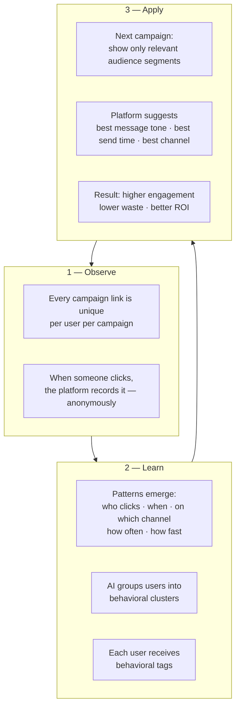
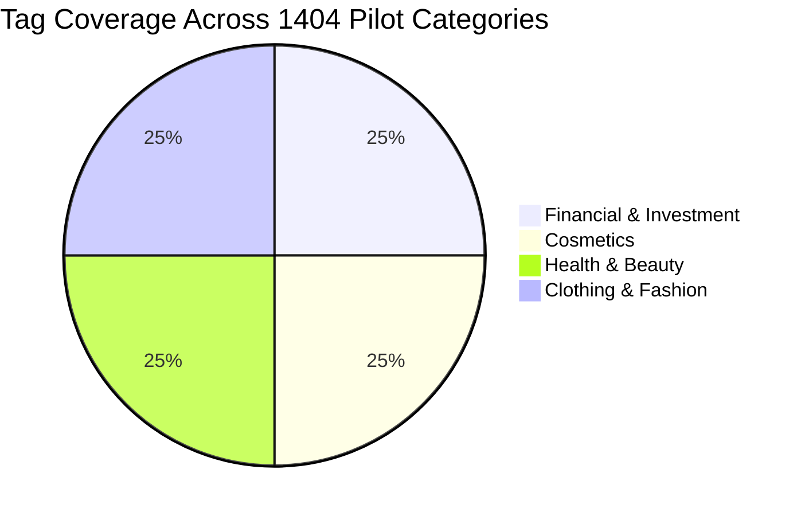
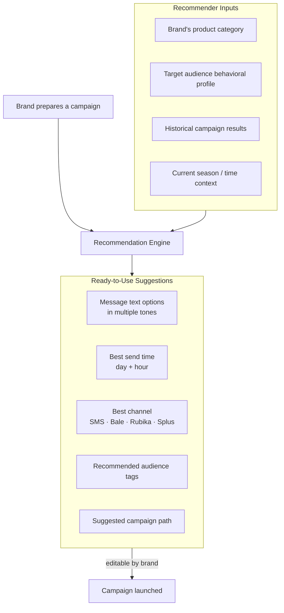
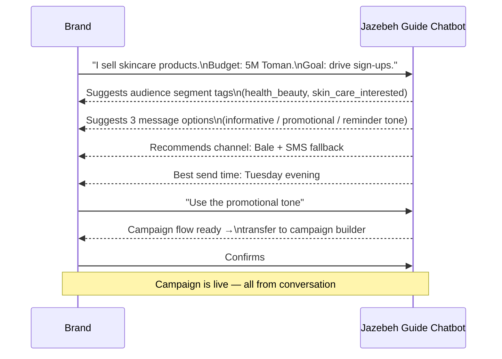
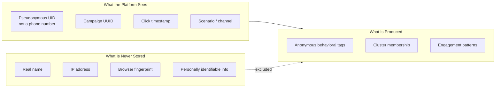

# AI & Behavioral Intelligence — Board Summary

---

## What the AI Does (Simply)

---

## From Raw Data to Actionable Tags

```mermaid
flowchart LR
    subgraph Raw["Raw Signal"]
        S1[Click]
        S2[View]
        S3[Sign-up]
        S4[Purchase]
        S5[Cancellation]
    end

    subgraph Features["Features Extracted"]
        F1[Recency\nwhen was last interaction?]
        F2[Frequency\nhow often?]
        F3[Value\nhow engaged?]
        F4[Time preference\nmorning / evening / weekend]
        F5[Channel preference\nSMS vs. messenger]
        F6[Response to reminders]
    end

    subgraph Tags["Behavioral Tags Applied"]
        T1["high_frequency_buyer"]
        T2["evening_engager"]
        T3["sms_preferred"]
        T4["fashion_interested"]
        T5["reminder_responsive"]
        T6["1,000+ other tags"]
    end

    Raw --> Features --> Tags
```

---

## Behavioral Tag Coverage — Four Pilot Categories

Each category has its own segment outputs and campaign playbook.

---

## The Recommendation Engine (1405)

Response time: MVP < 4 seconds · Advanced version < 500 ms

---

## The Jazebeh Guide Chatbot (1405)

---

## Privacy by Design

- All behavioral analysis is **anonymous and pseudonymous**
- No personal data enters the AI pipeline
- Audit log for every chatbot conversation (compliance)
- Opt-in/opt-out preference center enforced at send time

---

## Model Quality Scorecard

| Model | Metric | Target |
|---|---|---|
| Clustering (K-Means / DBSCAN) | Silhouette score | ≥ 0.45 |
| Behavioral labeling | Coverage of valid data | ≥ 60% |
| CTR / LTR prediction | AUC | ≥ 0.75 |
| Calibration | Brier score | Improved vs. baseline |
| Campaign uplift | CTR vs. non-targeted baseline | ≥ 2× |
| Drift detection | Alert latency | < 15 minutes |
| Model update | Service continuity | Zero downtime |
| Data schema consistency | Error rate | ≤ 2% |
| Historical data field coverage | Standard field coverage | ≥ 90% |
