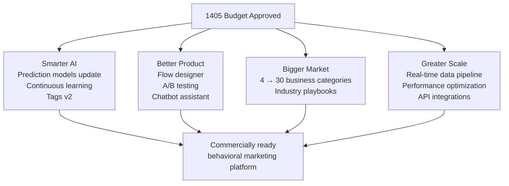
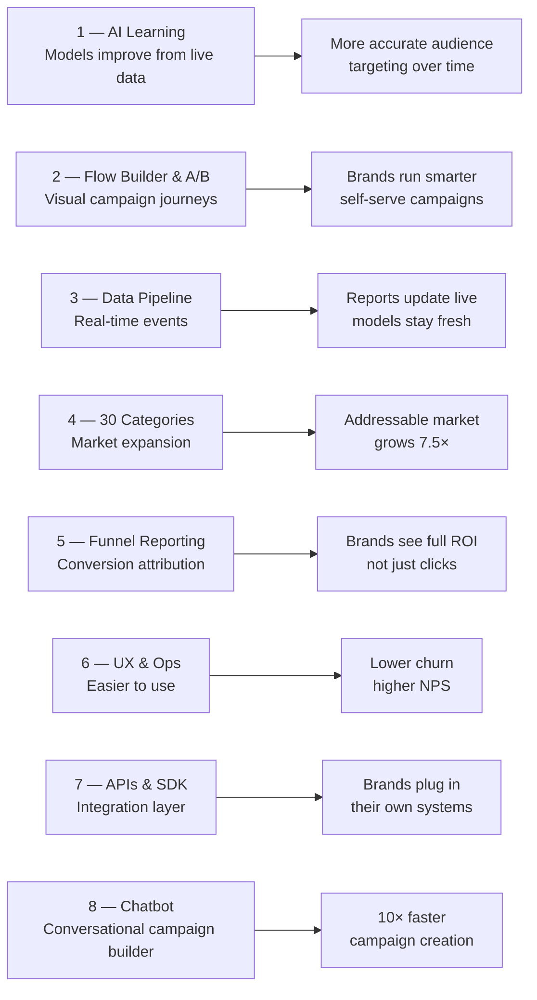
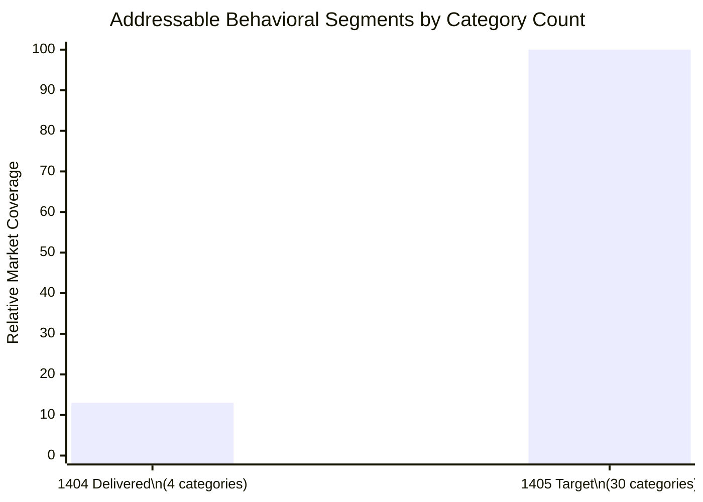
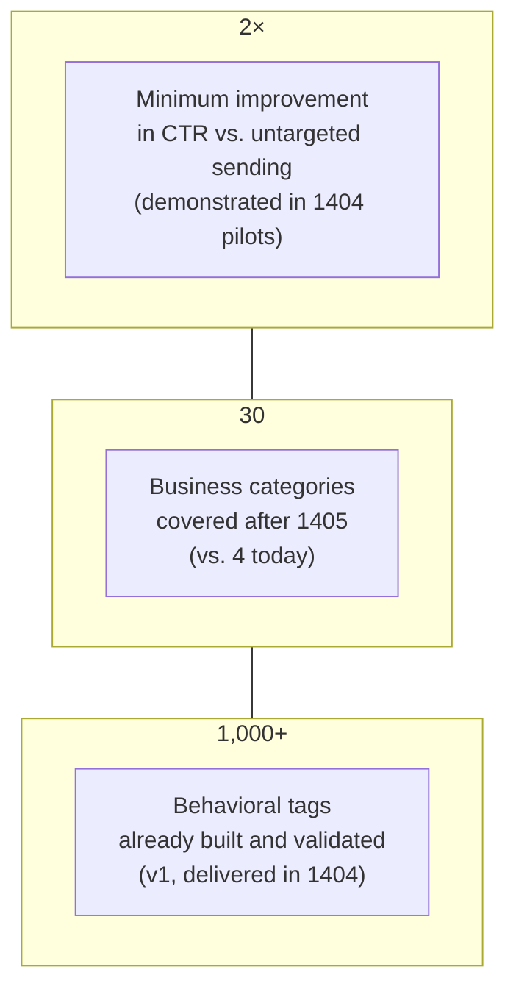

# 1405 Investment Case — What We're Asking For

---

## What Approval Unlocks

---

## Eight Initiatives — One-Line Summary

---

## Market Size Step-Up

Expanding from 4 to 30 categories means reaching **brands in food, travel, real estate, automotive, education, healthcare**, and more — the bulk of the Iranian consumer economy.

---

## The Business Case in Three Numbers

---

## Risk Mitigation

| Risk | Mitigation |
|---|---|
| AI model accuracy below target | Continuous learning loop with drift alerts; human review before deployment |
| Channel provider disruption | Automatic failover across 4 channels in < 3 seconds |
| Data quality degradation | Lineage tracking + automated quality gates in the pipeline |
| Scale / performance | Queue-based sending, Redis caching, horizontal scaling ready |
| Privacy / compliance | Purely pseudonymous data; opt-in/opt-out enforced; full audit log |
| Chatbot producing bad recommendations | Content compliance filter; user always edits before launch |

---

## Summary: What 1404 Proved, What 1405 Will Build On

```mermaid
flowchart LR
    subgraph Proven["Proven in 1404"]
        P1[✅ Platform works at pilot scale]
        P2[✅ 4 channels sending reliably]
        P3[✅ Behavioral tagging works]
        P4[✅ CTR improves with targeting]
        P5[✅ Agencies & brands use it]
    end

    subgraph Next["1405 Builds On This"]
        N1[🔧 Models learn continuously]
        N2[🔧 30 markets, not 4]
        N3[🔧 Visual campaign builder]
        N4[🔧 Chatbot reduces friction]
        N5[🔧 Full funnel attribution]
    end

    Proven --> Next --> Commercial[Commercially scalable\nbehavioral marketing platform]
```

